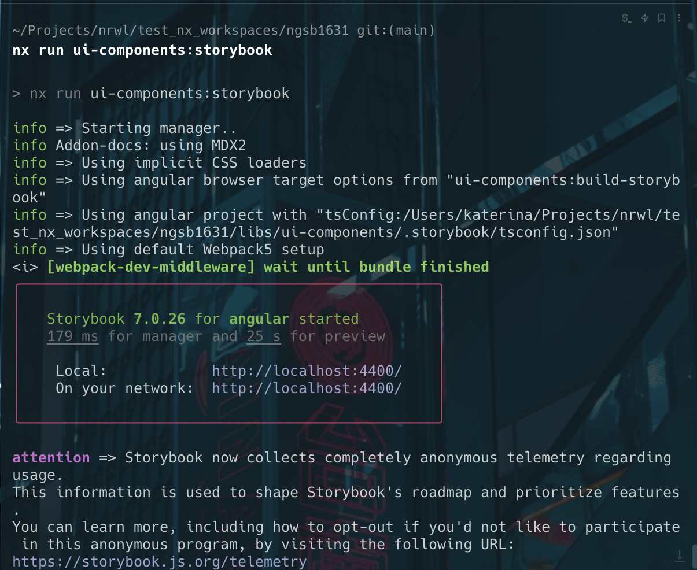

# Angular + Nx 16.3.1 + Storybook 7

## Steps

1. `npx create-nx-workspace@16.3.1 my-org` and chose `angular` and `integrated` monorepo
2. `cd my-org`
3. `nx g @nx/angular:lib ui-components`
4. `nx g @nx/angular:component --project=ui-components`
5. Now I have a library and a component, so I use the Storybook configuration guide found here: https://nx.dev/packages/storybook (the one you used)
6. `npm install -D @nx/storybook@16.3.1`
7. `nx g @nx/angular:storybook-configuration ui-components`
8. `nx run ui-components:storybook`

And all runs as expected:

